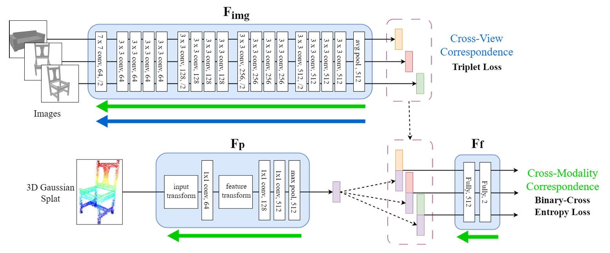

# Bridging the World of 2D and 3D Computer Vision

This repository contains the official implementation of the
paper "Bridging the World of 2D and 3D Computer Vision:
Self-Supervised Cross-modality Feature Learning through 3D Gaussian
Splatting" by Andrei Simionescu. This submission is part of the TuDelft
Bachelor Thesis project, and is digitally accessible through the faculty's
[repository](http://repository.tudelft.nl/).

*Current robotic perception systems utilize a variety of sensors to estimate and understand a robot's surroundings.
This paper focuses on a novel data representation technique that makes use of a recent scene reconstruction algorithm,
known as 3D Gaussian Splatting, to explicitly represent and reason about an environment using only a sparse set of
camera views as input. To achieve this, I generate and analyze the first cross-modal dataset consisting of 3D
Gaussians and views taken around ten household objects. I introduce the resulting 3D Gaussians and images to a
self-supervised feature learning network, that learns robust 2D and 3D embedding representations, by optimizing for
the cross-view and cross-modality correspondence pretext tasks. I experiment with several 3D Gaussian features as
input to the model and two point sub-network backbones, and report results on the two pretext tasks. The learned
features are subsequently fine-tuned for the 2D and 3D shape recognition tasks. Moreover, by leveraging the fast scene
reconstruction capabilities of the algorithm, I propose the use of rendered views as a visual memory aid to support
downstream robotic tasks. The proposed networks achieve comparable results to state-of-the-art methods for point and
image processing.*

## Architecture

The proposed self-supervised network architecture (figure adapted from Jing _et al._ [1]), featuring three sub-networks.
The first two are feature extractors for the different modalities: a ResNet-18 (_F_img_) that takes
the different views and trains for detecting when two views belong to the same object  (_i.e._
cross-view correspondence, blue arrow), and a PointNet model (_F_p_) model that processes and
embeds the unordered Gaussian point cloud data into a global feature vector.
The embeddings of the different modalities are then concatanated and used by the last sub-network
(_F_f_) that jointly optimizes all three sub-networks for predicting whether the two
cross-modal inputs belong to the same object (_i.e._ cross-modality correspondence, green arrow).



## Installation

Follow these steps to set up the environment and run the implementation locally:

### Prerequisites

- Python 3.8 or higher
- Pip
- Conda
- PyTorch 1.12

#### Clone the Repository

```bash
git clone https://github.com/SimiOy/Self-Supervised-Learning-for-3DGS.git
cd CV3dgs
```

#### Setup the Conda environment

```bash
conda env create -f environment.yml
```

#### Activate the Conda environment

```bash
conda activate CV3dgs
```

### Train Self-supervised model

A model can be trained from scratch using the following command:

```shell
python train_model.py --img_dir <path to images> --point_dir <path to point clouds> --model <model name> --batch_size <batch size> \
  --num_workers <number of workers> --num_iterations <number of iterations> --epoch <epochs> --optimizer <optimizer> \
  --learning_rate <learning rate> --momentum <momentum> --weight_decay <weight decay> --decay_steps <decay steps> \
  --decay_rate <decay rate> --num_point <number of points> --beta <beta> --log_dir <log directory> \
  --use_scale_and_rotation --use_normals --use_colors --furthest_point_sample
```

<details>
<summary><span style="font-weight: bold;">Command Line Arguments for train.py</span></summary>

#### --img_dir

Specifies the directory containing the image data.

#### --point_dir

Specifies the directory containing the 3D Gaussians point cloud data.

#### --model

Sets the model architecture to use (default: 'pointnet_cls').

#### --log_dir

Sets the directory for saving logs and model checkpoints.

#### --beta

Specifies the weight for the cross-modality loss (default 3.0).

#### --use_scale_and_rotation

Includes scaling and rotation data from the Gaussian point cloud as input features if set. Omit to disable.

#### --use_colors

Includes color (spherical harmonics) data from the Gaussian point cloud as input features if set. Omit to disable.

#### --furthest_point_sample

Uses furthest point sampling for point cloud sampling if set. Omit to disable.

#### --batch_size

Defines the number of samples in each batch (default 32).

#### --num_workers

Sets the number of worker threads for loading data (default 8).

#### --num_iterations

Specifies the total number of iterations for training (default 60000).

#### --epoch

Sets the number of epochs to train the model (default 100).

#### --optimizer

Chooses the type of optimizer to use, e.g., 'SGD'.

#### --learning_rate

Sets the initial learning rate (default 0.001).

#### --momentum

Specifies the momentum factor for the SGD optimizer (default 0.9).

#### --weight_decay

Defines the weight decay (L2 penalty) (default 0.0005).

#### --decay_steps

Sets the number of steps after which the learning rate should decay (default 2500).

#### --decay_rate

Specifies the factor by which the learning rate should decay (default 0.95).

#### --num_point

Determines the number of points per 3D model (default 2048).

#### --use_cpu

Use CPU mode for training, omit to use GPU by default.

#### --gpu

Specify GPU device number (default '0').

</details>
<br>

### Fine tune a model

Alternatively, model weights from the pre-trained log folder can be loaded and used during fine-tuning for the 2D and 3D shape recognition tasks.

```shell
srun python classification_train.py --img_dir <path to images> --point_dir <path to point clouds> --batch_size <batch size> --num_workers <number of workers> --log_dir <log directory> --num_views 64 --class_fraction <class fraction> > <output directory>
```

<details>
<summary><span style="font-weight: bold;">Command Line Arguments for train.py</span></summary>

#### --img_dir

Specifies the directory containing the image data.

#### --point_dir

Specifies the directory containing the 3D Gaussians point cloud data.

#### --log_dir

Specifies the model checkpoints to load the weights from.

#### --num_views

Specifies the space-separated number of views (required, integer list). For example, '--num_views 64 128' specifies
training on 64 and 128 views.

#### --class_fraction

Define the percentage of training data used during fine-tuning.

#### --batch_size

Defines the number of samples in each batch (default 32).

#### --num_workers

Sets the number of worker threads for loading data (default 8).

#### --use_cpu

Enables training using the CPU instead of a GPU. Default is GPU mode.

#### --gpu

Specifies the GPU device number to use for training (default '0').

</details>
<br>

### Citation

If you find this implementation useful, please consider citing:

```
@inproceedings{jing2021self,
  title={Self-supervised feature learning by cross-modality and cross-view correspondences},
  author={Jing, Longlong and Zhang, Ling and Tian, Yingli},
  booktitle={Proceedings of the IEEE/CVF conference on computer vision and pattern recognition},
  pages={1581--1591},
  year={2021}
}
```

```
@article{Pytorch_Pointnet_Pointnet2,
      Author = {Xu Yan},
      Title = {Pointnet/Pointnet++ Pytorch},
      Journal = {https://github.com/yanx27/Pointnet_Pointnet2_pytorch},
      Year = {2019}
}
```
